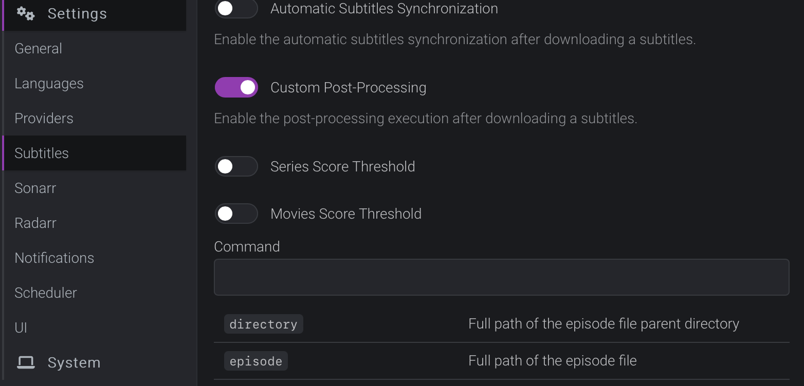

# subaligner
This repository contains scripts to run a standalone docker container for subtitle alignment.
This implementation is built on the python package [subaligner](https://github.com/baxtree/subaligner) and additionally 
includes a gunicorn server on top of a single-endpoint flask app. Slight modifications have been made 
to the subaligner package and can be viewed in the respective submodule e.g. allow passing audio track IDs.
In this submodule I include my own model trained on my large media library which, after preprocessing, yielded 
approximately 9,000 hours of data. <br>

My primary goals were: 
<ol>
  <li> To train a model on the exact data type I intend to align subtitles on</li>
  <li>To expose this model with a RESTful API that can be used to trigger alignment.</li>
</ol>


### Running the Container
You can build the image yourself: <br>
```
git clone https://github.com/albeltra/subaligner-standalone --recrusive
cd subaligner-standalone
docker build -t subaligner-standalone .
```
Then run it using your freshly built image or mine:

```
docker run \
       -v /movies:/movies \
       -v /tv:/tv \
       -p 8000:8000 \
       beltranalex928/subaligner-standalone \
```

### Triggering Alignment
With the container started, you can send a POST request to "/align" on port 8000 passing the media path
and subtitle path in a JSON payload. For example:
```
curl -X POST http://192.168.1.1:8000/align -H "Content-Type: application/json" -d '{"media": <PATH>, "subtitle": <PATH>' 
```

Integrating this container with Bazarr is incredibly simple and is actually the intended use case.
Navigate to Settings -> Subtitles and enable Custom Post Processing. <br> 



Adjust score thresholds to your liking and paste the following into the Command box:
```
curl -X POST http://192.168.1.1:8000/align  -H "Content-Type: application/json" -d '{"media": {{episode}}, "subtitle": {{subtitles}}}' 
```
NOTE: It is assumed that Bazarr (or whatever process that triggers alignment) is not configured to ignore ANY embedded 
subtitle types. All alignment jobs should only consider files with NO embedded subtitles. If your media DOES include 
any, they will be IRREVERSIBLY removed.

## OPTIONAL
By default, <strong>curl</strong> will wait for a response, which way take several minutes and lead to some undesirable 
consequences. To this end, I've created an additional implementation that employs the same WSGI server but offloads 
the alignment to an asynchronous task queue: <strong>rq</strong>. <br>

You can check it out [here](https://github.com/albeltra/subaligner-wsgi)